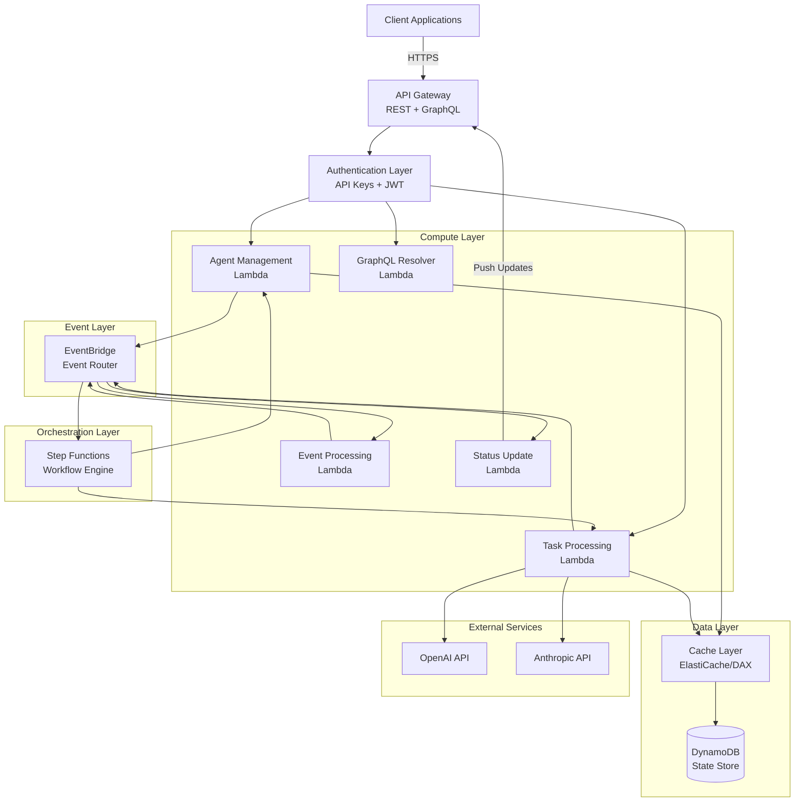

# Design Document: Realtime Agentic API

## Overview

The Realtime Agentic API is a serverless, event-driven system built on AWS infrastructure that provides a scalable platform for deploying and managing AI agents. The system leverages AWS CDK for infrastructure as code, Lambda for compute, Step Functions for workflow orchestration, EventBridge for event routing, and DynamoDB for state persistence.

The architecture follows a microservices pattern where each Lambda function handles a specific domain of functionality. EventBridge serves as the central nervous system, routing events between components. Step Functions orchestrate complex multi-step workflows including agent task execution, human-in-the-loop approvals, parallel agent coordination, and error handling with retries.

The system integrates with the Strands Agent framework to provide comprehensive agentic capabilities including natural language understanding, task planning, multi-step reasoning, tool calling, memory management, and multi-agent collaboration. Real-time status updates are delivered to clients through API Gateway connections, with EventBridge triggering update notifications as agent state changes.

## Architecture

### High-Level Architecture



### Component Architecture

The system is organized into the following layers:

1. **API Layer**: API Gateway handles REST and GraphQL endpoints, authentication, and client connections
2. **Compute Layer**: Lambda functions implement business logic for agents, tasks, events, and status updates
3. **Orchestration Layer**: Step Functions manage complex workflows with parallel execution, retries, and error handling
4. **Event Layer**: EventBridge routes events between components based on event patterns
5. **Data Layer**: DynamoDB stores persistent state with a caching layer for performance
6. **External Integration Layer**: Connections to LLM providers (OpenAI, Anthropic)

### Event-Driven Flow

1. Client sends request to API Gateway
2. API Gateway authenticates and routes to appropriate Lambda
3. Lambda processes request and publishes events to EventBridge
4. EventBridge routes events to Step Functions or other Lambdas
5. Step Functions orchestrate multi-step workflows
6. State changes are persisted to DynamoDB
7. Status updates are pushed to clients via API Gateway
8. Cache layer optimizes frequent data access

## Components and Interfaces

### API Gateway

**Responsibilities:**
- Expose REST and GraphQL endpoints
- Handle authentication (API keys and JWT)
- Manage client connections for real-time updates
- Route requests to appropriate Lambda functions
- Apply rate limiting and throttling

**REST Endpoints:**
- `POST /agents` - Create new agent
- `GET /agents/{id}` - Get agent details
- `PUT /agents/{id}` - Update agent
- `DELETE /agents/{id}` - Delete agent
- `POST /agents/{id}/tasks` - Create task for agent
- `GET /agents/{id}/tasks/{taskId}` - Get task status
- `GET /agents/{id}/status` - Get real-time agent status

**GraphQL Schema:**
```graphql
type Agent {
  id: ID!
  name: String!
  configuration: AgentConfiguration!
  status: AgentStatus!
  createdAt: String!
  updatedAt: String!
}

type Task {
  id: ID!
  agentId: ID!
  description: String!
  status: TaskStatus!
  steps: [TaskStep!]!
  result: String
  createdAt: String!
  completedAt: String
}

type AgentConfiguration {
  llmProvider: LLMProvider!
  model: String!
  tools: [Tool!]!
  systemPrompt: String
}

enum LLMProvider {
  OPENAI
  ANTHROPIC
}

enum AgentStatus {
  IDLE
  PROCESSING
  WAITING
  ERROR
}

enum TaskStatus {
  PENDING
  RUNNING
  COMPLETED
  FAILED
}

type Query {
  agent(id: ID!): Agent
  agents(limit: Int, nextToken: String): AgentConnection!
  task(agentId: ID!, taskId: ID!): Task
  tasks(agentId: ID!, limit: Int, nextToken: String): TaskConnection!
}

type Mutation {
  createAgent(input: CreateAgentInput!): Agent!
  updateAgent(id: ID!, input: UpdateAgentInput!): Agent!
  deleteAgent(id: ID!): Boolean!
  createTask(agentId: ID!, input: CreateTaskInput!): Task!
}

type Subscription {
  agentStatusUpdated(agentId: ID!): AgentStatus!
  taskProgressUpdated(agentId: ID!, taskId: ID!): TaskProgress!
}
```

### Lambda Functions

#### Agent Management Lambda

**Responsibilities:**
- Create, read, update, delete agents
- Validate agent configurations
- Publish agent lifecycle events
- Manage agent state in DynamoDB

**Interface:**
```typescript
interface AgentManagementHandler {
  createAgent(request: CreateAgentRequest): Promise<Agent>
  getAgent(agentId: string): Promise<Agent>
  updateAgent(agentId: string, updates: AgentUpdates): Promise<Agent>
  deleteAgent(agentId: string): Promise<void>
}

interface CreateAgentRequest {
  name: string
  configuration: AgentConfiguration
  userId: string
}

interface AgentConfiguration {
  llmProvider: 'openai' | 'anthropic'
  model: string
  tools: ToolDefinition[]
  systemPrompt?: string
  temperature?: number
  maxTokens?: number
}

interface ToolDefinition {
  name: string
  description: string
  parameters: Record<string, any>
  handler: string // Lambda ARN or function name
}
```

#### Task Processing Lambda

**Responsibilities:**
- Process agent tasks using Strands Agent framework
- Interact with LLM providers
- Execute tool calls
- Manage conversation context
- Update task state

**Interface:**
```typescript
interface TaskProcessingHandler {
  processTask(task: Task): Promise<TaskResult>
  executeStep(task: Task, step: TaskStep): Promise<StepResult>
  callTool(tool: string, parameters: Record<string, any>): Promise<any>
  generateResponse(context: Context, input: string): Promise<string>
}

interface Task {
  id: string
  agentId: string
  description: string
  context: Context
  steps: TaskStep[]
  currentStep: number
}

interface Context {
  conversationHistory: Message[]
  agentMemory: Record<string, any>
  taskState: Record<string, any>
}

interface TaskStep {
  id: string
  type: 'reasoning' | 'tool_call' | 'response'
  input: any
  output?: any
  status: 'pending' | 'running' | 'completed' | 'failed'
}
```

#### Event Processing Lambda

**Responsibilities:**
- Process events from EventBridge
- Route events to appropriate handlers
- Transform event data
- Trigger downstream actions

**Interface:**
```typescript
interface EventProcessingHandler {
  handleEvent(event: EventBridgeEvent): Promise<void>
  routeEvent(event: EventBridgeEvent): Promise<void>
}

interface EventBridgeEvent {
  source: string
  detailType: string
  detail: Record<string, any>
  time: string
}
```

#### Status Update Lambda

**Responsibilities:**
- Process status change events
- Push updates to connected clients
- Manage client connections
- Handle subscription management

**Interface:**
```typescript
interface StatusUpdateHandler {
  pushUpdate(agentId: string, status: AgentStatus): Promise<void>
  handleConnection(connectionId: string): Promise<void>
  handleDisconnection(connectionId: string): Promise<void>
  subscribe(connectionId: string, agentId: string): Promise<void>
}
```

#### GraphQL Resolver Lambda

**Responsibilities:**
- Resolve GraphQL queries and mutations
- Handle GraphQL subscriptions
- Validate GraphQL requests
- Transform data for GraphQL responses

**Interface:**
```typescript
interface GraphQLResolverHandler {
  resolveQuery(query: string, variables: Record<string, any>): Promise<any>
  resolveMutation(mutation: string, variables: Record<string, any>): Promise<any>
  handleSubscription(subscription: string, variables: Record<string, any>): Promise<void>
}
```

### Step Functions

#### Task Execution Workflow

**State Machine Definition:**
```json
{
  "Comment": "Agent task execution workflow",
  "StartAt": "InitializeTask",
  "States": {
    "InitializeTask": {
      "Type": "Task",
      "Resource": "arn:aws:lambda:REGION:ACCOUNT:function:TaskProcessing",
      "Parameters": {
        "action": "initialize",
        "taskId.$": "$.taskId"
      },
      "Next": "PlanTask",
      "Catch": [{
        "ErrorEquals": ["States.ALL"],
        "Next": "HandleError",
        "ResultPath": "$.error"
      }],
      "Retry": [{
        "ErrorEquals": ["States.TaskFailed"],
        "IntervalSeconds": 2,
        "MaxAttempts": 3,
        "BackoffRate": 2.0
      }]
    },
    "PlanTask": {
      "Type": "Task",
      "Resource": "arn:aws:lambda:REGION:ACCOUNT:function:TaskProcessing",
      "Parameters": {
        "action": "plan",
        "taskId.$": "$.taskId"
      },
      "Next": "ExecuteSteps",
      "ResultPath": "$.plan"
    },
    "ExecuteSteps": {
      "Type": "Map",
      "ItemsPath": "$.plan.steps",
      "MaxConcurrency": 1,
      "Iterator": {
        "StartAt": "ExecuteStep",
        "States": {
          "ExecuteStep": {
            "Type": "Task",
            "Resource": "arn:aws:lambda:REGION:ACCOUNT:function:TaskProcessing",
            "Parameters": {
              "action": "executeStep",
              "taskId.$": "$.taskId",
              "step.$": "$"
            },
            "End": true
          }
        }
      },
      "Next": "CompleteTask",
      "ResultPath": "$.results"
    },
    "CompleteTask": {
      "Type": "Task",
      "Resource": "arn:aws:lambda:REGION:ACCOUNT:function:TaskProcessing",
      "Parameters": {
        "action": "complete",
        "taskId.$": "$.taskId",
        "results.$": "$.results"
      },
      "End": true
    },
    "HandleError": {
      "Type": "Task",
      "Resource": "arn:aws:lambda:REGION:ACCOUNT:function:ErrorHandler",
      "Parameters": {
        "taskId.$": "$.taskId",
        "error.$": "$.error"
      },
      "End": true
    }
  }
}
```

#### Multi-Agent Collaboration Workflow

**State Machine Definition:**
```json
{
  "Comment": "Multi-agent collaboration workflow",
  "StartAt": "DistributeTasks",
  "States": {
    "DistributeTasks": {
      "Type": "Parallel",
      "Branches": [
        {
          "StartAt": "Agent1Task",
          "States": {
            "Agent1Task": {
              "Type": "Task",
              "Resource": "arn:aws:states:::states:startExecution.sync",
              "Parameters": {
                "StateMachineArn": "arn:aws:states:REGION:ACCOUNT:stateMachine:TaskExecution",
                "Input": {
                  "agentId.$": "$.agent1Id",
                  "taskId.$": "$.task1Id"
                }
              },
              "End": true
            }
          }
        },
        {
          "StartAt": "Agent2Task",
          "States": {
            "Agent2Task": {
              "Type": "Task",
              "Resource": "arn:aws:states:::states:startExecution.sync",
              "Parameters": {
                "StateMachineArn": "arn:aws:states:REGION:ACCOUNT:stateMachine:TaskExecution",
                "Input": {
                  "agentId.$": "$.agent2Id",
                  "taskId.$": "$.task2Id"
                }
              },
              "End": true
            }
          }
        }
      ],
      "Next": "AggregateResults"
    },
    "AggregateResults": {
      "Type": "Task",
      "Resource": "arn:aws:lambda:REGION:ACCOUNT:function:ResultAggregator",
      "End": true
    }
  }
}
```

#### Human-in-the-Loop Approval Workflow

**State Machine Definition:**
```json
{
  "Comment": "Human approval workflow",
  "StartAt": "RequestApproval",
  "States": {
    "RequestApproval": {
      "Type": "Task",
      "Resource": "arn:aws:lambda:REGION:ACCOUNT:function:ApprovalRequest",
      "Next": "WaitForApproval",
      "ResultPath": "$.approvalToken"
    },
    "WaitForApproval": {
      "Type": "Task",
      "Resource": "arn:aws:states:::lambda:invoke.waitForTaskToken",
      "Parameters": {
        "FunctionName": "arn:aws:lambda:REGION:ACCOUNT:function:ApprovalWaiter",
        "Payload": {
          "token.$": "$$.Task.Token",
          "taskId.$": "$.taskId"
        }
      },
      "Next": "CheckApproval",
      "TimeoutSeconds": 3600
    },
    "CheckApproval": {
      "Type": "Choice",
      "Choices": [{
        "Variable": "$.approved",
        "BooleanEquals": true,
        "Next": "ContinueTask"
      }],
      "Default": "RejectTask"
    },
    "ContinueTask": {
      "Type": "Task",
      "Resource": "arn:aws:lambda:REGION:ACCOUNT:function:TaskProcessing",
      "End": true
    },
    "RejectTask": {
      "Type": "Fail",
      "Error": "ApprovalRejected",
      "Cause": "Human reviewer rejected the task"
    }
  }
}
```

### EventBridge

**Event Patterns:**

```typescript
// Agent lifecycle events
interface AgentCreatedEvent {
  source: 'realtime-agentic-api.agents'
  detailType: 'AgentCreated'
  detail: {
    agentId: string
    userId: string
    configuration: AgentConfiguration
    timestamp: string
  }
}

interface AgentDeletedEvent {
  source: 'realtime-agentic-api.agents'
  detailType: 'AgentDeleted'
  detail: {
    agentId: string
    userId: string
    timestamp: string
  }
}

// Task events
interface TaskCreatedEvent {
  source: 'realtime-agentic-api.tasks'
  detailType: 'TaskCreated'
  detail: {
    taskId: string
    agentId: string
    description: string
    timestamp: string
  }
}

interface TaskCompletedEvent {
  source: 'realtime-agentic-api.tasks'
  detailType: 'TaskCompleted'
  detail: {
    taskId: string
    agentId: string
    result: any
    timestamp: string
  }
}

// Status events
interface AgentStatusChangedEvent {
  source: 'realtime-agentic-api.status'
  detailType: 'AgentStatusChanged'
  detail: {
    agentId: string
    oldStatus: AgentStatus
    newStatus: AgentStatus
    timestamp: string
  }
}

interface TaskProgressEvent {
  source: 'realtime-agentic-api.tasks'
  detailType: 'TaskProgress'
  detail: {
    taskId: string
    agentId: string
    currentStep: number
    totalSteps: number
    progress: number
    timestamp: string
  }
}

// Error events
interface ErrorEvent {
  source: 'realtime-agentic-api.errors'
  detailType: 'ErrorOccurred'
  detail: {
    component: string
    errorType: string
    errorMessage: string
    context: Record<string, any>
    timestamp: string
  }
}

// Scheduled events
interface ScheduledTaskEvent {
  source: 'realtime-agentic-api.scheduler'
  detailType: 'ScheduledTask'
  detail: {
    scheduleId: string
    taskType: string
    parameters: Record<string, any>
    timestamp: string
  }
}
```

**Event Rules:**

1. **Task Creation Rule**: Routes TaskCreated events to Task Execution Step Function
2. **Status Update Rule**: Routes AgentStatusChanged events to Status Update Lambda
3. **Error Handling Rule**: Routes ErrorOccurred events to Error Handler Lambda
4. **Scheduled Task Rule**: Routes ScheduledTask events to appropriate Lambda
5. **Multi-Agent Rule**: Routes agent collaboration events to Multi-Agent Step Function

### DynamoDB Schema

**Agents Table:**
```typescript
interface AgentRecord {
  PK: string // "AGENT#<agentId>"
  SK: string // "METADATA"
  agentId: string
  userId: string
  name: string
  configuration: AgentConfiguration
  status: AgentStatus
  createdAt: string
  updatedAt: string
  GSI1PK: string // "USER#<userId>"
  GSI1SK: string // "AGENT#<createdAt>"
}
```

**Tasks Table:**
```typescript
interface TaskRecord {
  PK: string // "AGENT#<agentId>"
  SK: string // "TASK#<taskId>"
  taskId: string
  agentId: string
  description: string
  status: TaskStatus
  plan: TaskPlan
  currentStep: number
  result?: any
  createdAt: string
  completedAt?: string
  GSI1PK: string // "TASK#<taskId>"
  GSI1SK: string // "STATUS#<status>"
}
```

**Context Table:**
```typescript
interface ContextRecord {
  PK: string // "AGENT#<agentId>"
  SK: string // "CONTEXT#<timestamp>"
  agentId: string
  conversationHistory: Message[]
  agentMemory: Record<string, any>
  taskState: Record<string, any>
  timestamp: string
  TTL: number // Auto-expire old context
}
```

**Connections Table (for real-time updates):**
```typescript
interface ConnectionRecord {
  PK: string // "CONNECTION#<connectionId>"
  SK: string // "METADATA"
  connectionId: string
  userId: string
  subscriptions: string[] // Array of agentIds
  connectedAt: string
  TTL: number
}
```

**Indexes:**
- **GSI1**: User-based queries (PK: USER#<userId>, SK: AGENT#<createdAt>)
- **GSI2**: Task status queries (PK: TASK#<taskId>, SK: STATUS#<status>)

### Cache Layer

**Implementation**: Amazon ElastiCache for Redis or DynamoDB Accelerator (DAX)

**Cached Data:**
- Agent configurations (TTL: 5 minutes)
- Frequently accessed task status (TTL: 30 seconds)
- User authentication tokens (TTL: token expiration)
- LLM provider responses for identical inputs (TTL: 1 hour)

**Cache Invalidation Strategy:**
- Write-through: Update cache on every write to DynamoDB
- Event-driven: Invalidate on state change events
- TTL-based: Automatic expiration for time-sensitive data

### Strands Agent Integration

**Agent Initialization:**
```typescript
import { StrandsAgent } from '@strands/agent'

class AgentService {
  async initializeAgent(config: AgentConfiguration): Promise<StrandsAgent> {
    const agent = new StrandsAgent({
      llmProvider: this.getLLMProvider(config.llmProvider),
      model: config.model,
      tools: this.loadTools(config.tools),
      systemPrompt: config.systemPrompt,
      memory: await this.loadMemory(config.agentId)
    })
    
    return agent
  }
  
  private getLLMProvider(provider: string) {
    switch (provider) {
      case 'openai':
        return new OpenAIProvider({
          apiKey: process.env.OPENAI_API_KEY
        })
      case 'anthropic':
        return new AnthropicProvider({
          apiKey: process.env.ANTHROPIC_API_KEY
        })
      default:
        throw new Error(`Unsupported provider: ${provider}`)
    }
  }
  
  private loadTools(toolDefs: ToolDefinition[]) {
    return toolDefs.map(def => ({
      name: def.name,
      description: def.description,
      parameters: def.parameters,
      execute: async (params: any) => {
        return await this.invokeLambda(def.handler, params)
      }
    }))
  }
  
  private async loadMemory(agentId: string) {
    const context = await this.dynamodb.query({
      TableName: 'Context',
      KeyConditionExpression: 'PK = :pk',
      ExpressionAttributeValues: {
        ':pk': `AGENT#${agentId}`
      },
      ScanIndexForward: false,
      Limit: 1
    })
    
    return context.Items[0]?.agentMemory || {}
  }
}
```

**Task Processing with Strands Agent:**
```typescript
class TaskProcessor {
  async processTask(task: Task): Promise<TaskResult> {
    const agent = await this.agentService.initializeAgent(task.agentConfiguration)
    
    // Plan the task
    const plan = await agent.plan(task.description)
    await this.saveTaskPlan(task.id, plan)
    
    // Execute steps
    const results = []
    for (const step of plan.steps) {
      const result = await this.executeStep(agent, step)
      results.push(result)
      await this.publishProgress(task.id, results.length, plan.steps.length)
    }
    
    // Generate final response
    const response = await agent.synthesize(results)
    
    // Save context
    await this.saveContext(task.agentId, agent.getContext())
    
    return {
      taskId: task.id,
      result: response,
      steps: results
    }
  }
  
  private async executeStep(agent: StrandsAgent, step: TaskStep) {
    switch (step.type) {
      case 'reasoning':
        return await agent.reason(step.input)
      case 'tool_call':
        return await agent.callTool(step.tool, step.parameters)
      case 'response':
        return await agent.generate(step.input)
      default:
        throw new Error(`Unknown step type: ${step.type}`)
    }
  }
}
```

## Data Models

### Core Domain Models

```typescript
// Agent
interface Agent {
  id: string
  userId: string
  name: string
  configuration: AgentConfiguration
  status: AgentStatus
  createdAt: Date
  updatedAt: Date
}

interface AgentConfiguration {
  llmProvider: 'openai' | 'anthropic'
  model: string
  tools: ToolDefinition[]
  systemPrompt?: string
  temperature?: number
  maxTokens?: number
  memoryConfig?: MemoryConfiguration
}

interface ToolDefinition {
  name: string
  description: string
  parameters: JSONSchema
  handler: string
}

interface MemoryConfiguration {
  maxContextLength: number
  summarizationThreshold: number
  retentionPolicy: 'session' | 'persistent'
}

type AgentStatus = 'idle' | 'processing' | 'waiting' | 'error'

// Task
interface Task {
  id: string
  agentId: string
  userId: string
  description: string
  status: TaskStatus
  plan?: TaskPlan
  currentStep: number
  result?: any
  error?: TaskError
  createdAt: Date
  startedAt?: Date
  completedAt?: Date
}

interface TaskPlan {
  steps: TaskStep[]
  estimatedDuration?: number
}

interface TaskStep {
  id: string
  type: 'reasoning' | 'tool_call' | 'response' | 'decision'
  description: string
  input: any
  output?: any
  status: StepStatus
  startedAt?: Date
  completedAt?: Date
}

type TaskStatus = 'pending' | 'running' | 'completed' | 'failed' | 'cancelled'
type StepStatus = 'pending' | 'running' | 'completed' | 'failed' | 'skipped'

interface TaskError {
  code: string
  message: string
  details?: any
  timestamp: Date
}

// Context
interface Context {
  agentId: string
  conversationHistory: Message[]
  agentMemory: AgentMemory
  taskState: TaskState
  timestamp: Date
}

interface Message {
  role: 'user' | 'assistant' | 'system' | 'tool'
  content: string
  timestamp: Date
  metadata?: Record<string, any>
}

interface AgentMemory {
  shortTerm: Record<string, any>
  longTerm: Record<string, any>
  facts: Fact[]
}

interface Fact {
  id: string
  content: string
  confidence: number
  source: string
  timestamp: Date
}

interface TaskState {
  variables: Record<string, any>
  checkpoints: Checkpoint[]
}

interface Checkpoint {
  stepId: string
  state: Record<string, any>
  timestamp: Date
}

// Events
interface Event {
  id: string
  source: string
  detailType: string
  detail: Record<string, any>
  timestamp: Date
}

// Authentication
interface User {
  id: string
  apiKeys: ApiKey[]
  jwtTokens: JwtToken[]
  permissions: Permission[]
}

interface ApiKey {
  key: string
  name: string
  createdAt: Date
  expiresAt?: Date
  lastUsedAt?: Date
}

interface JwtToken {
  token: string
  issuedAt: Date
  expiresAt: Date
  refreshToken?: string
}

interface Permission {
  resource: string
  actions: string[]
}
```

### Data Validation

```typescript
// Agent validation
function validateAgentConfiguration(config: AgentConfiguration): ValidationResult {
  const errors: string[] = []
  
  if (!['openai', 'anthropic'].includes(config.llmProvider)) {
    errors.push('Invalid LLM provider')
  }
  
  if (!config.model || config.model.trim() === '') {
    errors.push('Model is required')
  }
  
  if (config.temperature !== undefined && (config.temperature < 0 || config.temperature > 2)) {
    errors.push('Temperature must be between 0 and 2')
  }
  
  if (config.maxTokens !== undefined && config.maxTokens < 1) {
    errors.push('Max tokens must be positive')
  }
  
  for (const tool of config.tools) {
    if (!tool.name || !tool.description || !tool.handler) {
      errors.push(`Invalid tool definition: ${tool.name}`)
    }
  }
  
  return {
    valid: errors.length === 0,
    errors
  }
}

// Task validation
function validateTask(task: Partial<Task>): ValidationResult {
  const errors: string[] = []
  
  if (!task.agentId) {
    errors.push('Agent ID is required')
  }
  
  if (!task.description || task.description.trim() === '') {
    errors.push('Task description is required')
  }
  
  if (task.description && task.description.length > 10000) {
    errors.push('Task description too long (max 10000 characters)')
  }
  
  return {
    valid: errors.length === 0,
    errors
  }
}

interface ValidationResult {
  valid: boolean
  errors: string[]
}
```


## Correctness Properties

A property is a characteristic or behavior that should hold true across all valid executions of a system—essentially, a formal statement about what the system should do. Properties serve as the bridge between human-readable specifications and machine-verifiable correctness guarantees.

### Agent Management Properties

Property 1: Agent creation persistence
*For any* valid agent configuration, when an agent is created, retrieving that agent by ID should return the same configuration
**Validates: Requirements 1.1, 1.2, 1.4**

Property 2: Agent lifecycle events
*For any* agent, creating the agent should publish an AgentCreated event, and deleting the agent should publish an AgentDeleted event
**Validates: Requirements 1.3, 1.6**

Property 3: Agent update persistence
*For any* agent and valid update, applying the update and then retrieving the agent should reflect the updated values
**Validates: Requirements 1.5**

Property 4: Agent deletion completeness
*For any* agent, after deletion, querying for that agent should return not found
**Validates: Requirements 1.6**

### Natural Language Processing Properties

Property 5: LLM provider invocation
*For any* natural language input to an agent, the configured LLM provider should be invoked exactly once
**Validates: Requirements 2.1, 2.3**

Property 6: Conversation persistence
*For any* conversation turn, after generating a response, the conversation history should contain both the input and the response
**Validates: Requirements 2.4**

Property 7: Context retrieval
*For any* agent processing input, the agent's conversation context should be loaded from DynamoDB before processing
**Validates: Requirements 2.2**

Property 8: LLM retry behavior
*For any* LLM API call that fails, the system should retry up to 3 times with exponential backoff before giving up
**Validates: Requirements 2.5**

### Task Planning and Execution Properties

Property 9: Task decomposition
*For any* task, when the agent receives it, the task should be decomposed into at least one executable step
**Validates: Requirements 3.1**

Property 10: Task plan persistence
*For any* task, after planning, the task plan should be retrievable from DynamoDB
**Validates: Requirements 3.2**

Property 11: Sequential step execution
*For any* task with multiple steps, steps should execute in the order defined in the plan
**Validates: Requirements 3.3, 3.4**

Property 12: Task completion events
*For any* task that completes successfully, a TaskCompleted event should be published to EventBridge
**Validates: Requirements 3.6**

Property 13: Step failure handling
*For any* task step that fails, the error handling workflow should be triggered
**Validates: Requirements 3.5**

### Reasoning and Decision Making Properties

Property 14: Decision point evaluation
*For any* decision point encountered by an agent, the LLM provider should be consulted to evaluate options
**Validates: Requirements 4.1**

Property 15: Reasoning trace persistence
*For any* multi-step reasoning process, a reasoning trace should be stored in DynamoDB
**Validates: Requirements 4.2**

Property 16: Decision logging
*For any* decision made by an agent, the decision rationale should be logged
**Validates: Requirements 4.3**

Property 17: Tool invocation for information gathering
*For any* reasoning that requires external information, appropriate tools should be invoked
**Validates: Requirements 4.4**

### Tool Calling Properties

Property 18: Tool selection
*For any* tool call, the tool should be selected from the agent's configured tools based on the task requirements
**Validates: Requirements 5.1**

Property 19: Tool parameter validation
*For any* tool invocation, parameters should be validated before execution
**Validates: Requirements 5.2**

Property 20: Tool result handling
*For any* successful tool call, the result should be returned to the agent for further processing
**Validates: Requirements 5.3**

Property 21: Tool failure handling
*For any* failed tool call, an error message should be returned to the agent
**Validates: Requirements 5.4**

Property 22: Tool invocation logging
*For any* tool call, invocation details should be logged to DynamoDB
**Validates: Requirements 5.5**

### Memory and Context Properties

Property 23: Context retrieval before processing
*For any* agent input processing, relevant context should be retrieved from DynamoDB before processing begins
**Validates: Requirements 6.1**

Property 24: Comprehensive context persistence
*For any* context update, conversation history, task state, and agent memory should all be persisted to DynamoDB
**Validates: Requirements 6.2**

Property 25: Context summarization
*For any* context that exceeds the configured size limit, older context should be summarized using the LLM provider
**Validates: Requirements 6.3**

Property 26: Cache-first retrieval
*For any* context retrieval, the cache should be checked before querying DynamoDB
**Validates: Requirements 6.4**

Property 27: Cache invalidation on update
*For any* context update, corresponding cache entries should be invalidated
**Validates: Requirements 6.5**

### Multi-Agent Collaboration Properties

Property 28: Multi-agent coordination
*For any* task requiring multiple agents, the Step Function should coordinate execution according to the specified pattern (parallel or sequential)
**Validates: Requirements 7.1**

Property 29: Inter-agent messaging
*For any* agent-to-agent communication, a message event should be published to EventBridge
**Validates: Requirements 7.2**

Property 30: Message routing
*For any* inter-agent message, EventBridge should route the message to the correct target agent's Lambda function
**Validates: Requirements 7.3**

Property 31: Collaboration state management
*For any* multi-agent collaboration, agent handoffs and state transitions should be managed by the Step Function
**Validates: Requirements 7.4**

Property 32: Result aggregation
*For any* completed multi-agent collaboration, results from all participating agents should be aggregated
**Validates: Requirements 7.5**

### Real-Time Updates Properties

Property 33: Status change events
*For any* agent state change, a status update event should be published to EventBridge
**Validates: Requirements 8.1**

Property 34: Status event routing
*For any* status update event, EventBridge should route the event to the status update Lambda function
**Validates: Requirements 8.2**

Property 35: Client notification
*For any* status update, all connected clients subscribed to that agent should receive the update
**Validates: Requirements 8.3**

Property 36: Connection establishment
*For any* client requesting real-time updates, a connection should be established through API Gateway
**Validates: Requirements 8.4**

Property 37: Progress event emission
*For any* task in progress, progress events should be emitted at regular intervals
**Validates: Requirements 8.5**

### Event Processing Properties

Property 38: Event routing to matching rules
*For any* event published to EventBridge, the event should be routed to all rules that match the event pattern
**Validates: Requirements 9.1**

Property 39: Task creation workflow trigger
*For any* agent task creation event, the appropriate Step Function should be triggered
**Validates: Requirements 9.2**

Property 40: User interaction routing
*For any* user interaction event, EventBridge should route the event to the agent processing Lambda function
**Validates: Requirements 9.3**

Property 41: Scheduled task execution
*For any* scheduled event, the scheduled task Lambda function should be triggered
**Validates: Requirements 9.4**

Property 42: State change notification broadcast
*For any* state change notification, all subscribed Lambda functions should receive the notification
**Validates: Requirements 9.5**

Property 43: Error event routing
*For any* error event, EventBridge should route the event to the error handling Lambda function
**Validates: Requirements 9.6**

### Workflow Orchestration Properties

Property 44: Complete workflow execution
*For any* initiated workflow, the Step Function should execute all steps from start to finish unless an error occurs
**Validates: Requirements 10.1**

Property 45: Parallel branch execution
*For any* workflow with parallel branches, all branches should execute concurrently
**Validates: Requirements 10.2**

Property 46: Human approval pause
*For any* workflow requiring human approval, the Step Function should pause and wait for approval input
**Validates: Requirements 10.3**

Property 47: Step retry with exponential backoff
*For any* failed workflow step, the Step Function should retry with exponential backoff according to the configured policy
**Validates: Requirements 10.4**

Property 48: Error branch execution after retry exhaustion
*For any* workflow step where retries are exhausted, the error handling branch should execute
**Validates: Requirements 10.5**

Property 49: Agent handoff coordination
*For any* workflow requiring agent coordination, the Step Function should manage handoffs and state synchronization
**Validates: Requirements 10.6**

### GraphQL Properties

Property 50: GraphQL query resolution
*For any* valid GraphQL query, the Lambda function should resolve the query against DynamoDB and return the requested data
**Validates: Requirements 12.1**

### Authentication and Authorization Properties

Property 51: API key validation
*For any* request with an API key, the API Gateway should validate the key against stored credentials
**Validates: Requirements 13.1**

Property 52: JWT token verification
*For any* request with a JWT token, the API Gateway should verify the token signature and expiration
**Validates: Requirements 13.2**

Property 53: Authentication failure response
*For any* request with invalid authentication, the API Gateway should return a 401 Unauthorized response
**Validates: Requirements 13.3**

Property 54: Identity propagation
*For any* authenticated request, the user identity should be extracted and passed to Lambda functions
**Validates: Requirements 13.4**

Property 55: Permission verification
*For any* request processed by a Lambda function, the function should verify the user has permission for the operation
**Validates: Requirements 13.5**

Property 56: Authorization failure response
*For any* request with insufficient permissions, the Lambda function should return a 403 Forbidden response
**Validates: Requirements 13.6**

### LLM Provider Integration Properties

Property 57: Configured provider usage
*For any* agent with a configured LLM provider, all LLM operations should use that provider exclusively
**Validates: Requirements 14.1**

Property 58: API key inclusion
*For any* LLM API call, the API key from secure configuration should be included in the request
**Validates: Requirements 14.4**

Property 59: LLM failure retry
*For any* failed LLM API call, the Lambda function should log the error and retry according to the retry policy
**Validates: Requirements 14.5**

Property 60: Provider format adaptation
*For any* agent switching between LLM providers, the request format should be adapted to match the target provider's API
**Validates: Requirements 14.6**

### State Persistence Properties

Property 61: Agent creation with unique ID
*For any* created agent, the agent should be stored in DynamoDB with a unique ID
**Validates: Requirements 15.1**

Property 62: State update persistence
*For any* agent state change, the corresponding DynamoDB record should be updated
**Validates: Requirements 15.2**

Property 63: Task persistence
*For any* created task, the task details should be stored in DynamoDB
**Validates: Requirements 15.3**

Property 64: Conversation history append
*For any* conversation turn, the new turn should be appended to the conversation history in DynamoDB
**Validates: Requirements 15.4**

Property 65: Latest state retrieval
*For any* agent state query, the latest state should be retrieved from DynamoDB
**Validates: Requirements 15.5**

Property 66: Failure recovery
*For any* Lambda function failure, the next invocation should retrieve the persisted state and continue processing
**Validates: Requirements 15.6**

### Caching Properties

Property 67: Cache-first data access
*For any* query for frequently accessed data, the cache should be checked first and serve the data if available
**Validates: Requirements 16.1**

Property 68: Cache population on miss
*For any* cache miss, data should be retrieved from DynamoDB and the cache should be populated
**Validates: Requirements 16.2**

Property 69: Cache invalidation on update
*For any* data update in DynamoDB, corresponding cache entries should be invalidated
**Validates: Requirements 16.3**

Property 70: TTL-based expiration
*For any* cached entry, the entry should expire after the configured TTL period
**Validates: Requirements 16.4**

Property 71: LRU eviction
*For any* cache at full capacity, the least recently used entry should be evicted when adding a new entry
**Validates: Requirements 16.5**

### Error Handling Properties

Property 72: Error logging with context
*For any* error encountered by a Lambda function, the error should be logged with full context
**Validates: Requirements 18.1**

Property 73: Retriable error exponential backoff
*For any* retriable error, the Lambda function should retry with exponential backoff
**Validates: Requirements 18.2**

Property 74: Error event after retry exhaustion
*For any* error where retries are exhausted, an error event should be published to EventBridge
**Validates: Requirements 18.3**

Property 75: Step Function error branch
*For any* Step Function step failure, the error handling branch should execute
**Validates: Requirements 18.4**

Property 76: Descriptive error messages
*For any* failed agent operation, a descriptive error message should be returned to the client
**Validates: Requirements 18.5**

Property 77: Partial state preservation
*For any* critical error, partial state should be preserved to enable recovery
**Validates: Requirements 18.6**

## Error Handling

### Error Categories

1. **Client Errors (4xx)**
   - Invalid input validation
   - Authentication failures
   - Authorization failures
   - Resource not found
   - Rate limiting

2. **Server Errors (5xx)**
   - Lambda function failures
   - DynamoDB errors
   - LLM provider API failures
   - Step Function execution failures
   - EventBridge delivery failures

3. **Transient Errors**
   - Network timeouts
   - Throttling from AWS services
   - Temporary LLM provider unavailability

### Error Handling Strategies

**Retry Logic:**
```typescript
interface RetryConfig {
  maxAttempts: number
  initialDelayMs: number
  maxDelayMs: number
  backoffMultiplier: number
  retryableErrors: string[]
}

const defaultRetryConfig: RetryConfig = {
  maxAttempts: 3,
  initialDelayMs: 100,
  maxDelayMs: 10000,
  backoffMultiplier: 2.0,
  retryableErrors: [
    'ThrottlingException',
    'ServiceUnavailable',
    'InternalServerError',
    'TimeoutError'
  ]
}

async function withRetry<T>(
  operation: () => Promise<T>,
  config: RetryConfig = defaultRetryConfig
): Promise<T> {
  let lastError: Error
  let delay = config.initialDelayMs
  
  for (let attempt = 1; attempt <= config.maxAttempts; attempt++) {
    try {
      return await operation()
    } catch (error) {
      lastError = error
      
      if (!isRetryable(error, config.retryableErrors) || attempt === config.maxAttempts) {
        throw error
      }
      
      await sleep(delay)
      delay = Math.min(delay * config.backoffMultiplier, config.maxDelayMs)
    }
  }
  
  throw lastError
}
```

**Circuit Breaker:**
```typescript
class CircuitBreaker {
  private failureCount = 0
  private lastFailureTime?: Date
  private state: 'closed' | 'open' | 'half-open' = 'closed'
  
  constructor(
    private threshold: number,
    private timeoutMs: number,
    private resetTimeMs: number
  ) {}
  
  async execute<T>(operation: () => Promise<T>): Promise<T> {
    if (this.state === 'open') {
      if (Date.now() - this.lastFailureTime.getTime() > this.resetTimeMs) {
        this.state = 'half-open'
      } else {
        throw new Error('Circuit breaker is open')
      }
    }
    
    try {
      const result = await Promise.race([
        operation(),
        this.timeout()
      ])
      
      if (this.state === 'half-open') {
        this.reset()
      }
      
      return result
    } catch (error) {
      this.recordFailure()
      throw error
    }
  }
  
  private recordFailure() {
    this.failureCount++
    this.lastFailureTime = new Date()
    
    if (this.failureCount >= this.threshold) {
      this.state = 'open'
    }
  }
  
  private reset() {
    this.failureCount = 0
    this.state = 'closed'
    this.lastFailureTime = undefined
  }
  
  private async timeout(): Promise<never> {
    await sleep(this.timeoutMs)
    throw new Error('Operation timed out')
  }
}
```

**Error Response Format:**
```typescript
interface ErrorResponse {
  error: {
    code: string
    message: string
    details?: any
    requestId: string
    timestamp: string
  }
}

function formatError(error: Error, requestId: string): ErrorResponse {
  return {
    error: {
      code: error.name || 'InternalError',
      message: error.message,
      details: error instanceof AppError ? error.details : undefined,
      requestId,
      timestamp: new Date().toISOString()
    }
  }
}
```

**Dead Letter Queue:**
- Failed events are sent to DLQ for manual inspection
- DLQ messages include full event context and error details
- Automated alerts trigger when DLQ depth exceeds threshold

## Testing Strategy

### Dual Testing Approach

The system requires both unit testing and property-based testing for comprehensive coverage:

**Unit Tests:**
- Specific examples demonstrating correct behavior
- Edge cases (empty inputs, boundary values, special characters)
- Error conditions and failure scenarios
- Integration points between components
- REST and GraphQL endpoint behavior
- Infrastructure resource definitions

**Property-Based Tests:**
- Universal properties that hold for all inputs
- Comprehensive input coverage through randomization
- Minimum 100 iterations per property test
- Each test references its design document property

### Property-Based Testing Configuration

**Library Selection:**
- TypeScript/JavaScript: fast-check
- Python: Hypothesis
- Java: jqwik

**Test Structure:**
```typescript
import fc from 'fast-check'

// Feature: realtime-agentic-api, Property 1: Agent creation persistence
test('agent creation persistence', async () => {
  await fc.assert(
    fc.asyncProperty(
      agentConfigurationArbitrary(),
      async (config) => {
        // Create agent
        const agent = await createAgent(config)
        
        // Retrieve agent
        const retrieved = await getAgent(agent.id)
        
        // Verify configuration matches
        expect(retrieved.configuration).toEqual(config)
      }
    ),
    { numRuns: 100 }
  )
})

// Arbitrary generators
function agentConfigurationArbitrary() {
  return fc.record({
    llmProvider: fc.constantFrom('openai', 'anthropic'),
    model: fc.string({ minLength: 1, maxLength: 50 }),
    tools: fc.array(toolDefinitionArbitrary(), { maxLength: 10 }),
    systemPrompt: fc.option(fc.string({ maxLength: 1000 })),
    temperature: fc.option(fc.float({ min: 0, max: 2 })),
    maxTokens: fc.option(fc.integer({ min: 1, max: 100000 }))
  })
}

function toolDefinitionArbitrary() {
  return fc.record({
    name: fc.string({ minLength: 1, maxLength: 50 }),
    description: fc.string({ minLength: 1, maxLength: 200 }),
    parameters: fc.dictionary(fc.string(), fc.anything()),
    handler: fc.string({ minLength: 1, maxLength: 100 })
  })
}
```

### Unit Testing Examples

**Agent Management Tests:**
```typescript
describe('Agent Management', () => {
  test('create agent with valid configuration', async () => {
    const config = {
      llmProvider: 'openai',
      model: 'gpt-4',
      tools: [],
      systemPrompt: 'You are a helpful assistant'
    }
    
    const agent = await createAgent(config)
    
    expect(agent.id).toBeDefined()
    expect(agent.configuration).toEqual(config)
    expect(agent.status).toBe('idle')
  })
  
  test('reject agent creation with invalid provider', async () => {
    const config = {
      llmProvider: 'invalid',
      model: 'gpt-4',
      tools: []
    }
    
    await expect(createAgent(config)).rejects.toThrow('Invalid LLM provider')
  })
  
  test('delete agent removes from database', async () => {
    const agent = await createAgent(validConfig)
    await deleteAgent(agent.id)
    
    await expect(getAgent(agent.id)).rejects.toThrow('Agent not found')
  })
})
```

**Task Processing Tests:**
```typescript
describe('Task Processing', () => {
  test('task decomposition creates steps', async () => {
    const task = await createTask(agentId, 'Write a blog post about AI')
    const plan = await planTask(task.id)
    
    expect(plan.steps.length).toBeGreaterThan(0)
    expect(plan.steps[0].type).toBeDefined()
  })
  
  test('failed step triggers error handling', async () => {
    const task = await createTask(agentId, 'Invalid task')
    mockStepFailure()
    
    await executeTask(task.id)
    
    expect(task.status).toBe('failed')
    expect(task.error).toBeDefined()
  })
})
```

**Event Processing Tests:**
```typescript
describe('Event Processing', () => {
  test('agent creation publishes event', async () => {
    const eventSpy = jest.spyOn(eventBridge, 'putEvents')
    
    await createAgent(validConfig)
    
    expect(eventSpy).toHaveBeenCalledWith(
      expect.objectContaining({
        DetailType: 'AgentCreated'
      })
    )
  })
  
  test('status change routes to status lambda', async () => {
    const lambdaSpy = jest.spyOn(lambda, 'invoke')
    
    await publishStatusChange(agentId, 'processing')
    
    expect(lambdaSpy).toHaveBeenCalledWith(
      expect.objectContaining({
        FunctionName: 'StatusUpdateLambda'
      })
    )
  })
})
```

### Integration Testing

**End-to-End Workflow Tests:**
```typescript
describe('End-to-End Workflows', () => {
  test('complete agent 


## Correctness Properties

A property is a characteristic or behavior that should hold true across all valid executions of a system—essentially, a formal statement about what the system should do. Properties serve as the bridge between human-readable specifications and machine-verifiable correctness guarantees.

### Agent Management Properties

Property 1: Agent creation persistence
*For any* valid agent configuration, when an agent is created, retrieving that agent by ID should return the same configuration
**Validates: Requirements 1.1, 1.2, 1.4**

Property 2: Agent lifecycle events
*For any* agent, creating the agent should publish an AgentCreated event, and deleting the agent should publish an AgentDeleted event
**Validates: Requirements 1.3, 1.6**

Property 3: Agent update persistence
*For any* agent and valid update, applying the update and then retrieving the agent should reflect the updated values
**Validates: Requirements 1.5**

Property 4: Agent deletion completeness
*For any* agent, after deletion, querying for that agent should return not found
**Validates: Requirements 1.6**

### Natural Language Processing Properties

Property 5: LLM provider invocation
*For any* natural language input to an agent, the configured LLM provider should be invoked exactly once
**Validates: Requirements 2.1, 2.3**

Property 6: Conversation persistence
*For any* conversation turn, after generating a response, the conversation history should contain both the input and the response
**Validates: Requirements 2.4**

Property 7: Context retrieval
*For any* agent processing input, the agent's conversation context should be loaded from DynamoDB before processing
**Validates: Requirements 2.2**

Property 8: LLM retry behavior
*For any* LLM API call that fails, the system should retry up to 3 times with exponential backoff before giving up
**Validates: Requirements 2.5**

### Task Planning and Execution Properties

Property 9: Task decomposition
*For any* task, when the agent receives it, the task should be decomposed into at least one executable step
**Validates: Requirements 3.1**

Property 10: Task plan persistence
*For any* task, after planning, the task plan should be retrievable from DynamoDB
**Validates: Requirements 3.2**

Property 11: Sequential step execution
*For any* task with multiple steps, steps should execute in the order defined in the plan
**Validates: Requirements 3.3, 3.4**

Property 12: Task completion events
*For any* task that completes successfully, a TaskCompleted event should be published to EventBridge
**Validates: Requirements 3.6**

Property 13: Step failure handling
*For any* task step that fails, the error handling workflow should be triggered
**Validates: Requirements 3.5**

### Reasoning and Decision Making Properties

Property 14: Decision point evaluation
*For any* decision point encountered by an agent, the LLM provider should be consulted to evaluate options
**Validates: Requirements 4.1**

Property 15: Reasoning trace persistence
*For any* multi-step reasoning process, a reasoning trace should be stored in DynamoDB
**Validates: Requirements 4.2**

Property 16: Decision logging
*For any* decision made by an agent, the decision rationale should be logged
**Validates: Requirements 4.3**

Property 17: Tool invocation for information gathering
*For any* reasoning that requires external information, appropriate tools should be invoked
**Validates: Requirements 4.4**

### Tool Calling Properties

Property 18: Tool selection
*For any* tool call, the tool should be selected from the agent's configured tools based on the task requirements
**Validates: Requirements 5.1**

Property 19: Tool parameter validation
*For any* tool invocation, parameters should be validated before execution
**Validates: Requirements 5.2**

Property 20: Tool result handling
*For any* successful tool call, the result should be returned to the agent for further processing
**Validates: Requirements 5.3**

Property 21: Tool failure handling
*For any* failed tool call, an error message should be returned to the agent
**Validates: Requirements 5.4**

Property 22: Tool invocation logging
*For any* tool call, invocation details should be logged to DynamoDB
**Validates: Requirements 5.5**

### Memory and Context Properties

Property 23: Context retrieval before processing
*For any* agent input processing, relevant context should be retrieved from DynamoDB before processing begins
**Validates: Requirements 6.1**

Property 24: Comprehensive context persistence
*For any* context update, conversation history, task state, and agent memory should all be persisted to DynamoDB
**Validates: Requirements 6.2**

Property 25: Context summarization
*For any* context that exceeds the configured size limit, older context should be summarized using the LLM provider
**Validates: Requirements 6.3**

Property 26: Cache-first retrieval
*For any* context retrieval, the cache should be checked before querying DynamoDB
**Validates: Requirements 6.4**

Property 27: Cache invalidation on update
*For any* context update, corresponding cache entries should be invalidated
**Validates: Requirements 6.5**

### Multi-Agent Collaboration Properties

Property 28: Multi-agent coordination
*For any* task requiring multiple agents, the Step Function should coordinate execution according to the specified pattern (parallel or sequential)
**Validates: Requirements 7.1**

Property 29: Inter-agent messaging
*For any* agent-to-agent communication, a message event should be published to EventBridge
**Validates: Requirements 7.2**

Property 30: Message routing
*For any* inter-agent message, EventBridge should route the message to the correct target agent's Lambda function
**Validates: Requirements 7.3**

Property 31: Collaboration state management
*For any* multi-agent collaboration, agent handoffs and state transitions should be managed by the Step Function
**Validates: Requirements 7.4**

Property 32: Result aggregation
*For any* completed multi-agent collaboration, results from all participating agents should be aggregated
**Validates: Requirements 7.5**


### Real-Time Updates Properties

Property 33: Status change events
*For any* agent state change, a status update event should be published to EventBridge
**Validates: Requirements 8.1**

Property 34: Status event routing
*For any* status update event, EventBridge should route the event to the status update Lambda function
**Validates: Requirements 8.2**

Property 35: Client notification
*For any* status update, all connected clients subscribed to that agent should receive the update
**Validates: Requirements 8.3**

Property 36: Connection establishment
*For any* client requesting real-time updates, a connection should be established through API Gateway
**Validates: Requirements 8.4**

Property 37: Progress event emission
*For any* task in progress, progress events should be emitted at regular intervals
**Validates: Requirements 8.5**

### Event Processing Properties

Property 38: Event routing to matching rules
*For any* event published to EventBridge, the event should be routed to all rules that match the event pattern
**Validates: Requirements 9.1**

Property 39: Task creation workflow trigger
*For any* agent task creation event, the appropriate Step Function should be triggered
**Validates: Requirements 9.2**

Property 40: User interaction routing
*For any* user interaction event, EventBridge should route the event to the agent processing Lambda function
**Validates: Requirements 9.3**

Property 41: Scheduled task execution
*For any* scheduled event, the scheduled task Lambda function should be triggered
**Validates: Requirements 9.4**

Property 42: State change notification broadcast
*For any* state change notification, all subscribed Lambda functions should receive the notification
**Validates: Requirements 9.5**

Property 43: Error event routing
*For any* error event, EventBridge should route the event to the error handling Lambda function
**Validates: Requirements 9.6**

### Workflow Orchestration Properties

Property 44: Complete workflow execution
*For any* initiated workflow, the Step Function should execute all steps from start to finish unless an error occurs
**Validates: Requirements 10.1**

Property 45: Parallel branch execution
*For any* workflow with parallel branches, all branches should execute concurrently
**Validates: Requirements 10.2**

Property 46: Human approval pause
*For any* workflow requiring human approval, the Step Function should pause and wait for approval input
**Validates: Requirements 10.3**

Property 47: Step retry with exponential backoff
*For any* failed workflow step, the Step Function should retry with exponential backoff according to the configured policy
**Validates: Requirements 10.4**

Property 48: Error branch execution after retry exhaustion
*For any* workflow step where retries are exhausted, the error handling branch should execute
**Validates: Requirements 10.5**

Property 49: Agent handoff coordination
*For any* workflow requiring agent coordination, the Step Function should manage handoffs and state synchronization
**Validates: Requirements 10.6**

### GraphQL Properties

Property 50: GraphQL query resolution
*For any* valid GraphQL query, the Lambda function should resolve the query against DynamoDB and return the requested data
**Validates: Requirements 12.1**

### Authentication and Authorization Properties

Property 51: API key validation
*For any* request with an API key, the API Gateway should validate the key against stored credentials
**Validates: Requirements 13.1**

Property 52: JWT token verification
*For any* request with a JWT token, the API Gateway should verify the token signature and expiration
**Validates: Requirements 13.2**

Property 53: Authentication failure response
*For any* request with invalid authentication, the API Gateway should return a 401 Unauthorized response
**Validates: Requirements 13.3**

Property 54: Identity propagation
*For any* authenticated request, the user identity should be extracted and passed to Lambda functions
**Validates: Requirements 13.4**

Property 55: Permission verification
*For any* request processed by a Lambda function, the function should verify the user has permission for the operation
**Validates: Requirements 13.5**

Property 56: Authorization failure response
*For any* request with insufficient permissions, the Lambda function should return a 403 Forbidden response
**Validates: Requirements 13.6**

### LLM Provider Integration Properties

Property 57: Configured provider usage
*For any* agent with a configured LLM provider, all LLM operations should use that provider exclusively
**Validates: Requirements 14.1**

Property 58: API key inclusion
*For any* LLM API call, the API key from secure configuration should be included in the request
**Validates: Requirements 14.4**

Property 59: LLM failure retry
*For any* failed LLM API call, the Lambda function should log the error and retry according to the retry policy
**Validates: Requirements 14.5**

Property 60: Provider format adaptation
*For any* agent switching between LLM providers, the request format should be adapted to match the target provider's API
**Validates: Requirements 14.6**

### State Persistence Properties

Property 61: Agent creation with unique ID
*For any* created agent, the agent should be stored in DynamoDB with a unique ID
**Validates: Requirements 15.1**

Property 62: State update persistence
*For any* agent state change, the corresponding DynamoDB record should be updated
**Validates: Requirements 15.2**

Property 63: Task persistence
*For any* created task, the task details should be stored in DynamoDB
**Validates: Requirements 15.3**

Property 64: Conversation history append
*For any* conversation turn, the new turn should be appended to the conversation history in DynamoDB
**Validates: Requirements 15.4**

Property 65: Latest state retrieval
*For any* agent state query, the latest state should be retrieved from DynamoDB
**Validates: Requirements 15.5**

Property 66: Failure recovery
*For any* Lambda function failure, the next invocation should retrieve the persisted state and continue processing
**Validates: Requirements 15.6**

### Caching Properties

Property 67: Cache-first data access
*For any* query for frequently accessed data, the cache should be checked first and serve the data if available
**Validates: Requirements 16.1**

Property 68: Cache population on miss
*For any* cache miss, data should be retrieved from DynamoDB and the cache should be populated
**Validates: Requirements 16.2**

Property 69: Cache invalidation on update
*For any* data update in DynamoDB, corresponding cache entries should be invalidated
**Validates: Requirements 16.3**

Property 70: TTL-based expiration
*For any* cached entry, the entry should expire after the configured TTL period
**Validates: Requirements 16.4**

Property 71: LRU eviction
*For any* cache at full capacity, the least recently used entry should be evicted when adding a new entry
**Validates: Requirements 16.5**

### Error Handling Properties

Property 72: Error logging with context
*For any* error encountered by a Lambda function, the error should be logged with full context
**Validates: Requirements 18.1**

Property 73: Retriable error exponential backoff
*For any* retriable error, the Lambda function should retry with exponential backoff
**Validates: Requirements 18.2**

Property 74: Error event after retry exhaustion
*For any* error where retries are exhausted, an error event should be published to EventBridge
**Validates: Requirements 18.3**

Property 75: Step Function error branch
*For any* Step Function step failure, the error handling branch should execute
**Validates: Requirements 18.4**

Property 76: Descriptive error messages
*For any* failed agent operation, a descriptive error message should be returned to the client
**Validates: Requirements 18.5**

Property 77: Partial state preservation
*For any* critical error, partial state should be preserved to enable recovery
**Validates: Requirements 18.6**


## Error Handling

### Error Categories

1. **Client Errors (4xx)**: Invalid input validation, authentication failures, authorization failures, resource not found, rate limiting

2. **Server Errors (5xx)**: Lambda function failures, DynamoDB errors, LLM provider API failures, Step Function execution failures, EventBridge delivery failures

3. **Transient Errors**: Network timeouts, throttling from AWS services, temporary LLM provider unavailability

### Error Handling Strategies

**Retry Logic with Exponential Backoff:**
- Maximum 3 retry attempts for transient errors
- Initial delay: 100ms
- Backoff multiplier: 2.0
- Maximum delay: 10 seconds
- Retryable errors: ThrottlingException, ServiceUnavailable, InternalServerError, TimeoutError

**Circuit Breaker Pattern:**
- Prevents cascading failures to external services
- Opens after threshold failures within time window
- Half-open state allows test requests
- Automatic reset after cooldown period

**Error Response Format:**
All errors returned to clients follow a consistent structure with error code, message, details, request ID, and timestamp.

**Dead Letter Queue:**
- Failed events sent to DLQ for manual inspection
- DLQ messages include full event context and error details
- Automated alerts when DLQ depth exceeds threshold

## Testing Strategy

### Dual Testing Approach

The system requires both unit testing and property-based testing for comprehensive coverage.

**Unit Tests** focus on:
- Specific examples demonstrating correct behavior
- Edge cases (empty inputs, boundary values, special characters)
- Error conditions and failure scenarios
- Integration points between components
- REST and GraphQL endpoint behavior
- Infrastructure resource definitions

**Property-Based Tests** focus on:
- Universal properties that hold for all inputs
- Comprehensive input coverage through randomization
- Minimum 100 iterations per property test
- Each test references its design document property using tag format: **Feature: realtime-agentic-api, Property {number}: {property_text}**

### Property-Based Testing Configuration

**Library Selection:**
- TypeScript/JavaScript: fast-check
- Python: Hypothesis  
- Java: jqwik

Each correctness property must be implemented by a single property-based test that runs at least 100 iterations with randomized inputs.

### Testing Coverage

**Agent Management:**
- Property tests for agent CRUD operations
- Unit tests for validation edge cases
- Integration tests for event publishing

**Task Processing:**
- Property tests for task decomposition and execution
- Unit tests for specific task types
- Integration tests for Step Function workflows

**Event Processing:**
- Property tests for event routing
- Unit tests for event transformation
- Integration tests for end-to-end event flows

**Authentication/Authorization:**
- Property tests for token validation
- Unit tests for permission checks
- Integration tests for API Gateway integration

**State Persistence:**
- Property tests for data consistency
- Unit tests for cache behavior
- Integration tests for DynamoDB operations

**Error Handling:**
- Property tests for retry logic
- Unit tests for error formatting
- Integration tests for failure recovery
